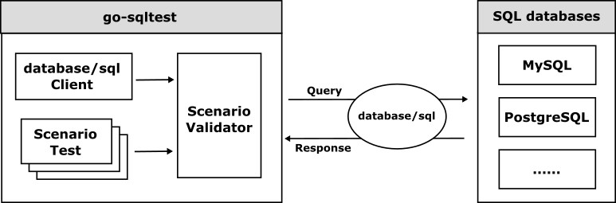

# go-sqltest

The go-sqltest is a scenario test framework for SQL-compatible databases. 
The go-sqltest imports the scenario test files and runs the scenario test to the target SQL-compatible databases as the following.

